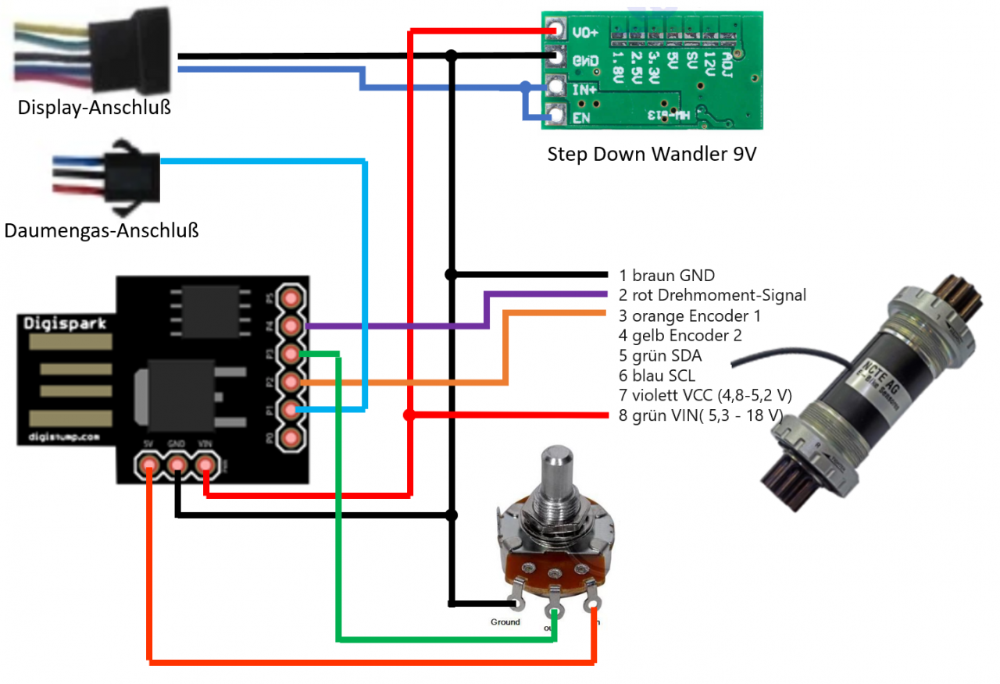
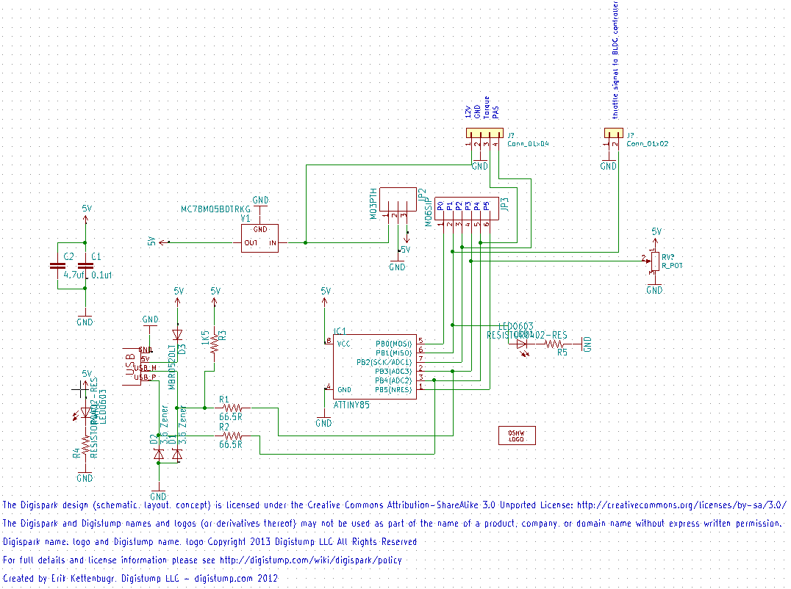

# Minimal_E-Bike_Torquesensor_Precontroller
based on a digispark

[Deutschsprachige Schritt-für-Schritt Anleitung](https://github.com/stancecoke/Minimal_E-Bike_Torquesensor_Precontroller/wiki/Schritt-f%C3%BCr-Schritt-Anleitung)

Reads in the analog torque signal and the digital PAS signal and calculates the output to the throttle connector of a commercial E-bike BLDC-Controller. The assistfactor can be adjusteb by the potentiometer. Caution, the digispark has a build in 1k Pullup resistor! So use a linear Poti with appox 1k resistance

  
  
  

  
